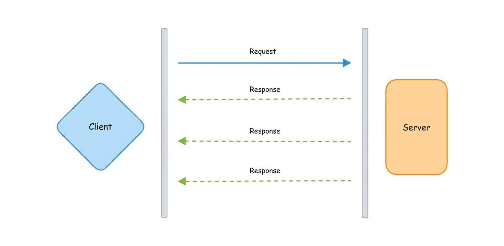
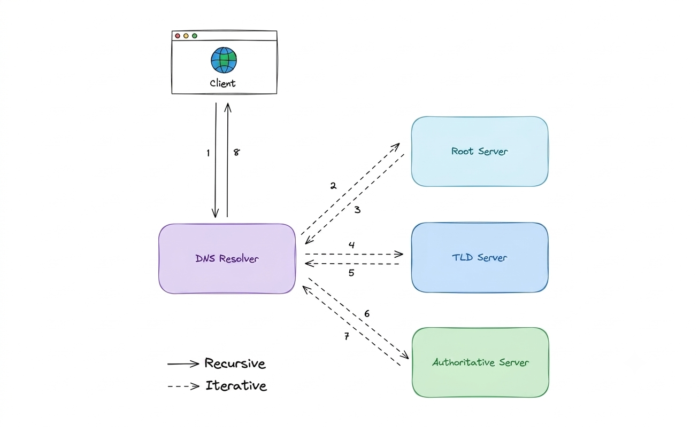

## IP

An IP address is a unique address that identifies a device on the internet or a local network. IP stands for _"Internet Protocol"_, which is the set of rules governing the format of data sent via the internet or local network.

In essence, IP addresses are the identifier that allows information to be sent between devices on a network. They contain location information and make devices accessible for communication. The internet needs a way to differentiate between different computers, routers, and websites. IP addresses provide a way of doing so and form an essential part of how the internet works.

### Versions

Now, let's learn about the different versions of IP addresses:

### 1. IPv4

- What it is: The original standard created in the 1980s.
- The Format: It uses a 32-bit numeric format written as four numbers separated by dots _(e.g., `102.22.192.181`)_.
- The Limit: It only allows for about 4 billion unique addresses. Because billions of people now have smartphones, laptops, and smart devices, the world has officially run out of unused IPv4 addresses.

### 2. IPv6

- What it is: The modern upgrade built to solve the address shortage.
- The Format: It uses a much larger 128-bit alphanumeric format written in hexadecimal separated by colons 
_(e.g., `2001:0db8:85a3:0000:0000:8a2e:0370:7334`)_ .
- The Limit: It provides over 340 undecillion addresses (that is $340 \times 10^{36}$). It is an unimaginably large number — enough to give every single grain of sand on Earth its own unique IP address for centuries to come

### Types

IP addresses are categorized in two ways: Scope (where they can be seen) and Behavior (how they are assigned).

### Scope: Public vs Private

- Public IP: The single address given to your entire home or office network by your Internet Service Provider (ISP). The outside internet only sees this one address.
  - Example: Your home router's public address.

- Private IP: A secret address assigned to each individual device inside your private network by your router. The outside world cannot see these.
  - Example: Your phone and laptop having different IPs (192.168.1.5 and 192.168.1.6) while connected to the same Wi-Fi.

### Behavior: Static vs. Dynamic

- Static IP: An address that is manually configured and never changes. They are reliable but more expensive.
  - Best for: Servers hosting websites, remote access setups, or corporate VPNs.

- Dynamic IP: An address that changes automatically over time. They are assigned by a system called DHCP (Dynamic Host Configuration Protocol). This is the standard for most consumer devices because it allows networks to efficiently reuse addresses.
  - Best for: Personal laptops, smartphones, and home internet connections. 

## OSI Model

The OSI (Open Systems Interconnection) Model is a conceptual framework that explains how computers send data to each other over a network.

Think of it as a universal language for networking. Instead of looking at network communication as one massive, confusing process, the OSI model breaks it down into 7 distinct, stacked layers. Each layer has a specific job and talks only to the layers directly above and below it.

### Why does the OSI model matter?

Even though the modern internet runs on a slightly different model (TCP/IP), the OSI model remains the gold standard for learning because it:

- Simplifies Troubleshooting: If a connection fails, engineers can pinpoint exactly which layer is broken _(e.g., a broken cable is a Layer 1 issue; an expired security certificate is a Layer 6/7 issue)_.

- Standardizes Hardware: It ensures a router made by Cisco can perfectly talk to a laptop made by Apple.

- Secures Systems: It helps engineers build a security-first mindset by protecting data at every level of the network stack.

### Layers

The seven abstraction layers of the OSI model can be defined as follows, from top to bottom:

### 1. Application

This is the only layer that directly interacts with data from the user. Software applications like web browsers and email clients rely on the application layer to initiate communication. But it should be made clear that client software applications are not part of the application layer, rather the application layer is responsible for the protocols and data manipulation that the software relies on to present meaningful data to the user. 
Application layer protocols include HTTP,HTTPS, FTP, SMTP.

### 2. Presentation

The presentation layer is also called the Translation layer. The data from the application layer is extracted here and manipulated as per the required format to transmit over the network. The functions of the presentation layer are translation, encryption/decryption, and compression.

### 3. Session

This is the layer responsible for opening and closing communication between the two devices. The time between when the communication is opened and closed is known as the session. The session layer ensures that the session stays open long enough to transfer all the data being exchanged, and then promptly closes the session in order to avoid wasting resources. The session layer also synchronizes data transfer with checkpoints.

### 4. Transport

The transport layer (also known as layer 4) is responsible for end-to-end communication between the two devices. This includes taking data from the session layer and breaking it up into chunks called segments before sending it to the Network layer (layer 3). It is also responsible for reassembling the segments on the receiving device into data the session layer can consume.

### 5. Network

The network layer is responsible for facilitating data transfer between two different networks. The network layer breaks up segments from the transport layer into smaller units, called packets, on the sender's device, and reassembles these packets on the receiving device. The network layer also finds the best physical path for the data to reach its destination this is known as routing. If the two devices communicating are on the same network, then the network layer is unnecessary.

### 6. Data Link

The data link layer is very similar to the network layer, except the data link layer facilitates data transfer between two devices on the same network. The data link layer takes packets from the network layer and breaks them into smaller pieces called frames.

### 7. Physical

This layer includes the physical equipment involved in the data transfer, such as the cables and switches. This is also the layer where the data gets converted into a bit stream, which is a string of 1s and 0s. The physical layer of both devices must also agree on a signal convention so that the 1s can be distinguished from the 0s on both devices.

## TCP and UDP

At Layer 4 (Transport Layer), the two most important protocols that dictate how data travels across the internet are TCP and UDP.

### TCP

- TCP is a connection-oriented protocol. Before any data is sent, the sender and receiver must perform a handshake to establish a reliable connection.
- Guaranteed Delivery: TCP has built-in error-checking. If a data packet gets lost along the way, TCP automatically asks for it to be re-transmitted.
- Ordered Packets: It guarantees that data will be delivered in the exact order it was sent.
- The Catch: Because it checks for errors and waits for confirmations, it has a larger network overhead and is comparatively slower.
- Best For: Web pages (HTTP/HTTPS), emails (SMTP), and file transfers (FTP)—where losing even a single piece of data breaks the file.

## UDP
UDP is a connectionless protocol. It doesn't establish a formal connection or wait for a handshake; it simply fires packets of data directly to the recipient as fast as possible.

- Zero Overhead: There is no overhead for opening, maintaining, or terminating a connection. Data is continuously sent, whether the recipient is ready to receive it or not.
- No Safety Net: It does not check for errors, nor does it re-transmit lost packets. If data drops, it's gone.
- The Benefit: It is incredibly fast and efficient with minimal latency.
- Best For: Live video streaming, online gaming, VoIP (voice calls), and DNS—where speed is everything, and missing a single frame or second of audio is better than waiting for it to reload.

### TCP vs UDP

TCP is a connection-oriented protocol, whereas UDP is a connectionless protocol. A key difference between TCP and UDP is speed, as TCP is comparatively slower than UDP. Overall, UDP is a much faster, simpler, and more efficient protocol, however, retransmission of lost data packets is only possible with TCP.

TCP provides ordered delivery of data from user to server (and vice versa), whereas UDP is not dedicated to end-to-end communications, nor does it check the readiness of the receiver.

| Feature             | TCP                                         | UDP                                |
| ------------------- | ------------------------------------------- | ---------------------------------- |
| Connection          | Requires an established connection          | Connectionless protocol            |
| Guaranteed delivery | Can guarantee delivery of data              | Cannot guarantee delivery of data  |
| Re-transmission     | Re-transmission of lost packets is possible | No re-transmission of lost packets |
| Speed               | Slower than UDP                             | Faster than TCP                    |
| Broadcasting        | Does not support broadcasting               | Supports broadcasting              |
| Use cases           | HTTPS, HTTP, SMTP, POP, FTP, etc            | Video streaming, DNS, VoIP, etc    |

## Domain Name System (DNS)

We know that machines need IP addresses (like `142.250.190.46`) to find and talk to each other. However, humans are much better at remembering names like `google.com` than long strings of numbers.

The Domain Name System (DNS) solves this problem. It is a hierarchical, decentralized system that acts as the phonebook of the internet, translating human-readable domain names into machine-readable IP addresses.

### How DNS works

#### Step 1: The Local Cache Check (Fast Lane)

Before reaching out to the internet, your device tries to find the IP address instantly using local storage:

- Browser Cache: Your web browser (like `Chrome` or `Firefox`) checks its own history to see if you have visited `example.com` recently. If it finds the IP address, it loads the site instantly.
- OS / Hosts File: If the browser doesn't have it, it asks your computer's Operating System (OS), which checks its local DNS cache and system files.

#### Step 2: The Internet Resolution (If Cache Misses)

If the IP address isn't found in any local cache, your computer has to ask the internet, process called a DNS Lookup happens behind the scenes. Here is how a query resolves in 8 steps:
- A client types `example.com` into a web browser, and the query travels to the internet where it is received by a DNS Resolver.
- The resolver recursively queries a DNS Root Nameserver (.).
- The root server responds to the resolver with the address of a Top-Level Domain (TLD) Nameserver (like `.com` or `.org`).
- The resolver makes a new request to the designated TLD server (in this case, the `.com` TLD).
- The TLD server responds with the IP address of the domain's specific Authoritative Nameserver.
- The recursive resolver sends a final query to the domain's authoritative nameserver.
- The specific IP address for example.com is returned to the resolver from the nameserver.
- The DNS resolver responds to the web browser with the destination IP address.

#### Step 3: Saving the Results (Caching)

- The DNS resolver sends the destination IP address back to your web browser so it can finally load the website.
- The Save: The browser immediately saves (caches) the IP address locally alongside a expiration timer called a TTL (Time to Live). The next time you visit example.com, the browser skips all the internet steps and loads the page instantly from its cache.

### Server types:

Now, let's look at the four key groups of servers that make up the DNS infrastructure.

### 1. DNS Resolver (The Middleman)

The DNS Recursive Resolver is the first stop in a DNS query. It acts as an intermediary between your web browser and the wider internet infrastructure.
- How it works: After receiving a request from a client, it first checks its own cache. If it misses, it handles the complex legwork of hunting down the IP address by sequentially querying the Root, TLD, and Authoritative servers before delivering the final answer back to you.

### 2. DNS root server (The Director)

The Root Nameserver accepts the resolver's query and acts as a directory signpost.
- How it works: It reads the extension of the domain you want (`.com`, `.net`, `.org`, etc.) and directs the resolver to the correct Top-Level Domain (TLD) nameserver.
- Scale & Routing: These servers are overseen by a nonprofit called ICANN. While there are 13 logical types of root nameservers known to every resolver, there are actually hundreds of physical copies scattered globally. They use Anycast routing to automatically forward your request to the nearest physical machine for maximum speed.

### 3. TLD nameserver (The Registry)

A Top-Level Domain (TLD) Nameserver maintains information for all domain names sharing a common extension (everything after the last dot in a URL).

Management of TLD nameservers is handled by the IANA (a branch of ICANN), which divides them into two major groups:
- Generic TLDs (gTLDs): Traditional or functional domains like `.com`, `.org`, `.net`, `.edu`, and `.gov`.
- Country Code TLDs (ccTLDs): Location-specific domains tied to countries or states, such as `.uk`, `.us`, `.in`, and `.jp`.

### 4. DNS Resolver (The Source of Truth)

The Authoritative Nameserver is the final destination in the lookup loop. It holds the definitive, actual DNS records for the specific domain name you are trying to reach (e.g., `google.com`).
- A Records: If the server finds a standard A record, it returns the direct IP address back to the resolver.
- CNAME Records: If the domain uses an alias (CNAME record), it returns a secondary domain name instead. The resolver must then start a fresh lookup to find the IP address of that alias.
- Error Handling: If the domain does not exist anywhere in its records, it returns an `NXDOMAIN` (Non-Existent Domain) error message.

## Query Types

There are three types of queries in a DNS system:

### Recursive

In a recursive query, a DNS client requires that a DNS server (typically a DNS recursive resolver) will respond to the client with either the requested resource record or an error message if the resolver can't find the record.

### Iterative

In an iterative query, a DNS client provides a hostname, and the DNS Resolver returns the best answer it can. If the DNS resolver has the relevant DNS records in its cache, it returns them. If not, it refers the DNS client to the Root Server or another Authoritative Name Server that is nearest to the required DNS zone. The DNS client must then repeat the query directly against the DNS server it was referred.

### Non-recursive

A non-recursive query is a query in which the DNS Resolver already knows the answer. It either immediately returns a DNS record because it already stores it in a local cache, or queries a DNS Name Server which is authoritative for the record, meaning it definitely holds the correct IP for that hostname. In both cases, there is no need for additional rounds of queries (like in recursive or iterative queries). Rather, a response is immediately returned to the client.

### Record Types

DNS records (aka zone files) are instructions that live in authoritative DNS servers and provide information about a domain including what IP address is associated with that domain and how to handle requests for that domain.

These records consist of a series of text files written in what is known as _DNS syntax_. DNS syntax is just a string of characters used as commands that tell the DNS server what to do. All DNS records also have a _"TTL"_, which stands for time-to-live, and indicates how often a DNS server will refresh that record.

There are more record types but for now, let's look at some of the most commonly used ones:

- **A (Address record)**: This is the record that holds the IP address of a domain.
- **AAAA (IP Version 6 Address record)**: The record that contains the IPv6 address for a domain (as opposed to A records, which stores the IPv4 address).
- **CNAME (Canonical Name record)**: Forwards one domain or subdomain to another domain, does NOT provide an IP address.
- **MX (Mail exchanger record)**: Directs mail to an email server.
- **TXT (Text Record)**: This record lets an admin store text notes in the record. These records are often used for email security.
- **NS (Name Server records)**: Stores the name server for a DNS entry.
- **SOA (Start of Authority)**: Stores admin information about a domain.
- **SRV (Service Location record)**: Specifies a port for specific services.
- **PTR (Reverse-lookup Pointer record)**: Provides a domain name in reverse lookups.
- **CERT (Certificate record)**: Stores public key certificates.

## Subdomains

A subdomain is an additional part of our main domain name. It is commonly used to logically separate a website into sections. We can create multiple subdomains or child domains on the main domain.

For example, `blog.example.com` where `blog` is the subdomain, `example` is the primary domain and `.com` is the top-level domain (TLD). Similar examples can be `support.example.com` or `careers.example.com`.

## DNS Zones

A DNS zone is a distinct part of the domain namespace which is delegated to a legal entity like a person, organization, or company, who is responsible for maintaining the DNS zone. A DNS zone is also an administrative function, allowing for granular control of DNS components, such as authoritative name servers.

## DNS Caching

A DNS cache (sometimes called a DNS resolver cache) is a temporary database, maintained by a computer's operating system, that contains records of all the recent visits and attempted visits to websites and other internet domains. In other words, a DNS cache is just a memory of recent DNS lookups that our computer can quickly refer to when it's trying to figure out how to load a website.

The Domain Name System implements a time-to-live (TTL) on every DNS record. TTL specifies the number of seconds the record can be cached by a DNS client or server. When the record is stored in a cache, whatever TTL value came with it gets stored as well. The server continues to update the TTL of the record stored in the cache, counting down every second. When it hits zero, the record is deleted or purged from the cache. At that point, if a query for that record is received, the DNS server has to start the resolution process.

## Reverse DNS

A reverse DNS lookup is a DNS query for the domain name associated with a given IP address. This accomplishes the opposite of the more commonly used forward DNS lookup, in which the DNS system is queried to return an IP address. The process of reverse resolving an IP address uses PTR records. If the server does not have a PTR record, it cannot resolve a reverse lookup.

Reverse lookups are commonly used by email servers. Email servers check and see if an email message came from a valid server before bringing it onto their network. Many email servers will reject messages from any server that does not support reverse lookups or from a server that is highly unlikely to be legitimate.

_Note: Reverse DNS lookups are not universally adopted as they are not critical to the normal function of the internet._

## Examples

These are some widely used managed DNS solutions:

- [Route53](https://aws.amazon.com/route53)
- [Cloudflare DNS](https://www.cloudflare.com/dns)
- [Google Cloud DNS](https://cloud.google.com/dns)
- [Azure DNS](https://azure.microsoft.com/en-in/services/dns)
- [NS1](https://ns1.com/products/managed-dns)
